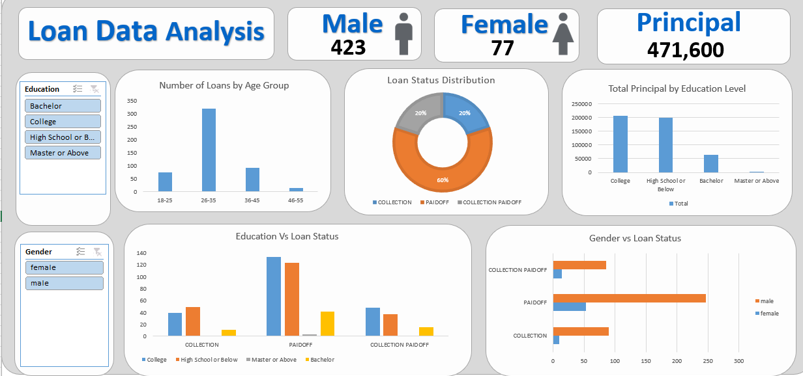

# 📊 Bank Loan Data Analysis Dashboard

## 🎯 Project Objective
The objective of this project is to analyze bank loan data to uncover trends in loan applications, customer demographics, and repayment behaviors. This interactive dashboard helps in understanding the risk factors and performance of different loan categories, enabling data-driven financial decisions.

## 🛠️ Tools & Technologies Used
* **Microsoft Excel:** Data Cleaning, Data Formatting, Complex Pivot Tables, and Interactive Dashboard Design.

## 📂 Project Files
* `Bank_Loan_Insights_Analysis.xlsx` - The main Excel file containing the raw data, pivot tables, and the final interactive dashboard.
* `Bank_Loan_Dataset.csv` - The raw dataset used for the analysis.

## 📈 Key Business Insights
Based on the data of 500 loan applications, here are the key findings:
* **Customer Demographics:** The vast majority of loan applicants are Male (84.6%), and the highest number of applicants fall in the **26-35 age group** (318 applicants).
* **Education Level:** Applicants with a **"College"** education level hold the highest total principal amount (207,100), closely followed by those with "High School or Below" (198,800).
* **Loan Status Overview:** Out of the total loans, **60% (300)** were fully 'PAIDOFF' on time, 20% went to 'COLLECTION', and 20% were 'COLLECTION PAIDOFF' (paid after the due date).
* **Term Analysis:** Loans are typically distributed between 15-day and 30-day terms, with distinct repayment patterns in each category.

## 📸 Dashboard Snapshot

*(Note: Ensure the uploaded screenshot file in the repository matches this name)*

## 💡 Credits
* **Dataset & Guidance:** Special thanks to [Data Tutorials (YouTube)](https://www.youtube.com/watch?v=N_8I-yN_u18) for the inspiration and guidance on building this financial dashboard.
